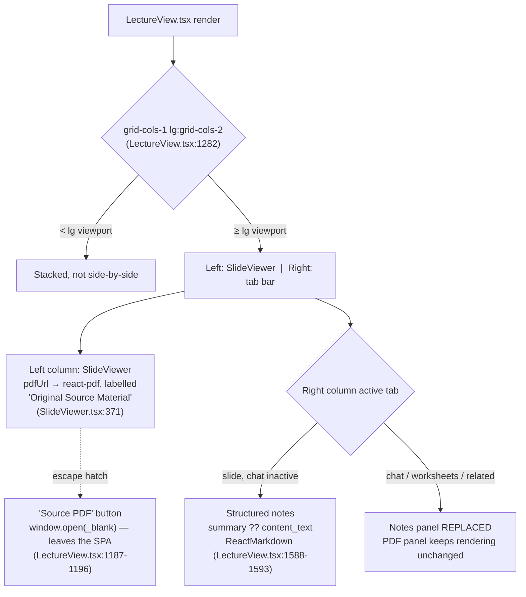
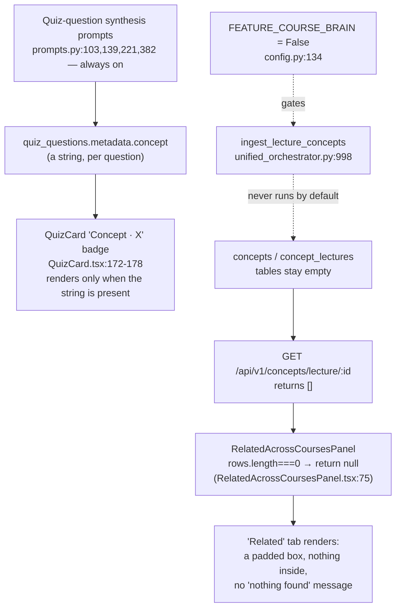
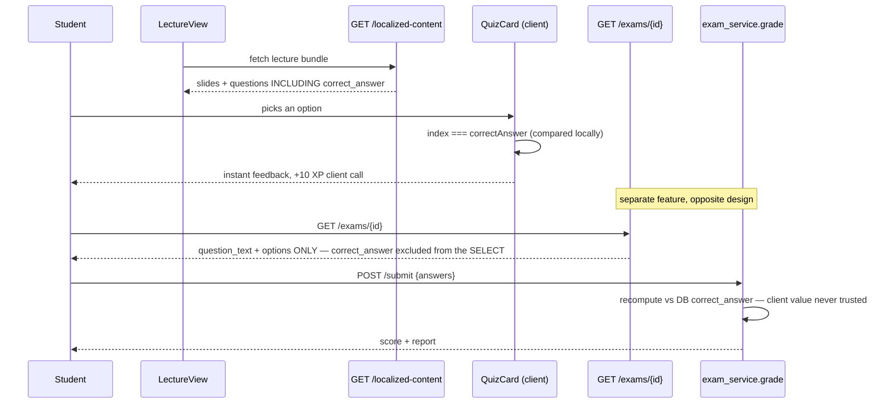
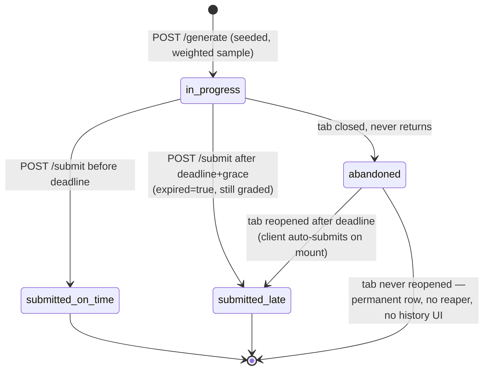
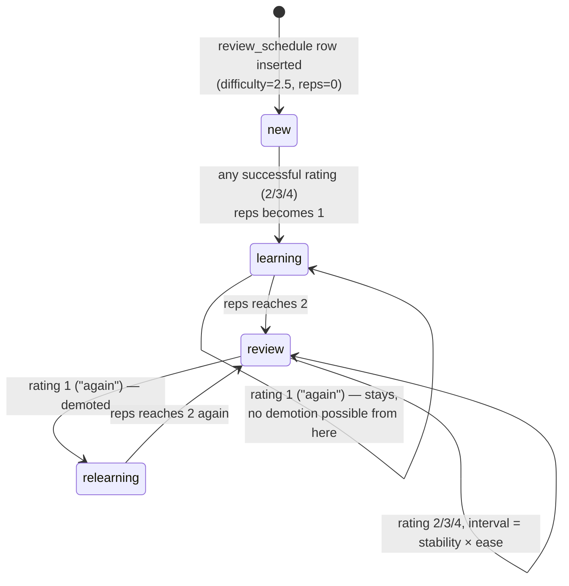
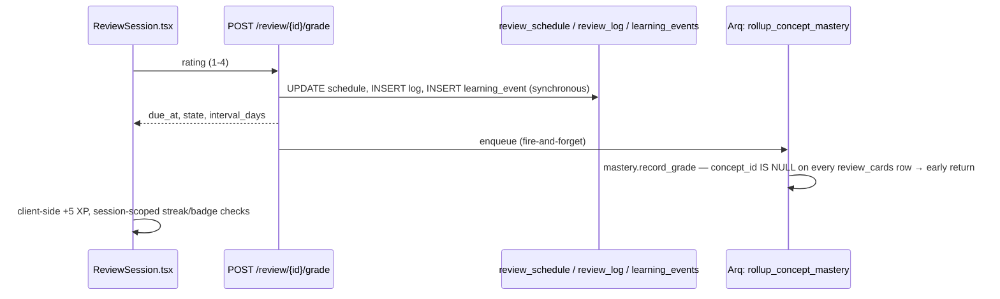
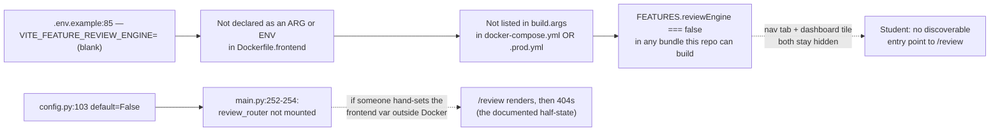

# Learning Features Primer — Learnstation

**Purpose.** A companion to [`docs/thesis/ARCHITECTURE_PRIMER.md`](ARCHITECTURE_PRIMER.md) for the same
bachelor thesis. That document covers the pipeline, the two tutors, the data model, and the
architecture/security story (its Parts 1–5). This one covers what it deliberately left out: what a
student actually experiences after content is published — the structured-vs-PDF lecture view, quiz
mechanics, and the spaced-repetition review engine. This is the material for **Session 5** of
`docs/thesis/THESIS_PLAN.md` ("Consuming the content: interactive learning features") and touches
Session 6 where the review engine's XP hooks overlap gamification.

**Method, same bar as the architecture primer.** Three independent research passes (parser
subagents, each scoped to one subsystem, none aware of the others' findings), followed by direct
re-verification of every load-bearing or surprising claim by the orchestrating session — re-opening
the cited file and confirming the quoted text, not trusting the research pass on its own. Every
diagram below only includes claims that survived that second read. Nothing here was copied from the
architecture primer's appendix without being re-derived from code at the current commit; where the
two documents cite the same fact, that is stated explicitly as agreement, not assumed.

> ### ⚠ A naming trap this document exists partly to prevent
>
> **`src/pages/Ascent.tsx` is not the spaced-repetition review screen.** It is the gamification hub
> (XP, badges, mind map, skill tree) reachable from the "Ascent" nav item. The actual SRS
> card-grading UI is a different component entirely, `src/features/review/ReviewSession.tsx`,
> mounted at the route `/review` (`src/lib/routes.ts:16`), not `/ascent`. "Daily Ascent" is this
> feature's internal/product codename (see the module docstring at
> [`scheduler.py:1-10`](../../backend/services/review/scheduler.py:1)); "Ascent" the nav item is an
> unrelated page that happens to share the word. Confirmed by an exhaustive case-insensitive grep of
> `Ascent.tsx` for `review|grade|flashcard`: all five hits are decorative prose in narrative cards,
> none wired to `review_cards`, `review_schedule`, or any review API call. Conflating the two in
> thesis prose would be a citable error — Part 3 below is about `ReviewSession.tsx`.

---

## Contents

- [Part 1 — Structured content vs. the raw PDF](#part-1--structured-content-vs-the-raw-pdf)
- [Part 2 — Quiz mechanics: in-lecture vs. mock exam](#part-2--quiz-mechanics-in-lecture-vs-mock-exam)
- [Part 3 — Spaced repetition: the review engine](#part-3--spaced-repetition-the-review-engine)
- [Part 4 — Correction to an existing figure](#part-4--correction-to-an-existing-figure)
- [Part 5 — Honesty ledger addendum](#part-5--honesty-ledger-addendum)

---

## Part 1 — Structured content vs. the raw PDF

This is the thesis's own contrast made concrete: is the "interactive, structured" experience
actually different from reading a static PDF, and how?

### L1 — Lecture view layout: co-visible, not a toggle, and conditional

**Claim.** The structured/raw contrast is real, but it is two independent components co-visible
only under specific conditions (desktop width, "slide" tab, chat closed) — not a persistent
split-screen, and there is no dedicated "PDF mode" or route at all.

**Provenance.** Grid: `LectureView.tsx:1282-1283`. PDF panel visibility is a pure function of data,
not a toggle: `showPdfPanel = !!pdfUrl || pdfLoadFailed` (`SlideViewer.tsx:294`). Notes precedence
(`summary` preferred over the fuller `content_text`) and empty-state fallback ("This slide has no
notes yet"): `LectureView.tsx:1588-1597`. No `/lecture/:id/pdf` route exists anywhere in
`src/lib/routes.ts` (grepped, zero hits). A lecture can genuinely have no PDF at all — distinguished
in code from a signed-URL resolution failure, both surfaced honestly rather than silently merged
(`LectureView.tsx:81-84`; failure path shows a retry UI, `SlideViewer.tsx:387-413`,
`data-testid="pdf-error-state"`).

**Worth stating plainly in the thesis:** `SlideViewer` receives `content`/`summary` as props but
never renders them as visible text — they are used only to build the text-to-speech string
(`prepareTTSText`, `SlideViewer.tsx:90-94`). The actual notes prose is drawn entirely in
`LectureView.tsx`'s own right-column tab. This was independently confirmed by direct re-read (a
whole-file grep for `content`/`summary` in `SlideViewer.tsx` turns up only the TTS use).

### L2 — Two unrelated "concept" mechanisms, one of them silently empty

The README's "Enhanced Lecture View — Auto-generated structured notes with highlighted concepts"
(`README.md:18`) names one feature. There are two, and only one of them can ever show anything in a
default deployment.

**Claim.** "Highlighted concepts" is really two independent mechanisms: an always-on, cosmetic
per-question badge fed by the quiz-synthesis prompts, and a structurally-correct but
silently-empty-by-default cross-course concept graph. Flipping `FEATURE_COURSE_BRAIN` on fixes only
the second; it has zero effect on the first, since they share no code path.

**Provenance.** Quiz-badge path: `QuizCard.tsx:172-178`, mapped in
`src/services/lectureService.ts:56` with its own comment confirming the string "comes from the
upgraded quiz prompt," not the concept graph. Gate: `backend/core/config.py:134` (re-derived fresh:
`feature_course_brain: bool = Field(alias="FEATURE_COURSE_BRAIN", default=False)`). Ingestion call
site: `unified_orchestrator.py:998` — line number re-verified at HEAD; it had drifted from the
architecture primer's original `:938` citation by 60 lines across intervening commits (a second,
independent instance of the same line-drift class documented in that primer's verification log).
Frontend consequence: `RelatedAcrossCoursesPanel.tsx:75`, `if (rows.length === 0) return null;`,
inside an unconditionally-rendered wrapper (`LectureView.tsx:1519-1524`) — so the tab itself always
appears, resolving to an unexplained empty box.

**A sharper, previously uncatalogued finding.** The ingestion function's own fallback path is worse
than merely gated off — its comment (`unified_orchestrator.py:985-996`) states that calling it with
no arguments on a v5-pipeline lecture would tag the concept graph with the *difficulty* string
(`"easy"/"medium"/"hard"`) instead of a real concept name, because its auto-fetch reads a
`lecture_blueprints` row the unified pipeline never writes. Even an operator who force-enables the
flag today would get nonsense concepts, not just missing ones.

**There is also a third, unconnected "concept" surface, hardcoded dead.** `src/types/domain.ts`
defines a `TreeNode` type with `type: '... | 'concept'`, but its only render site,
`SlideViewer.tsx:150`, is `const showMindMap = false;` — a literal, unconditional `false`, confirmed
by grep to be the only definition or assignment of that variable anywhere in the repository.

---

## Part 2 — Quiz mechanics: in-lecture vs. mock exam

### L3 — The two quiz surfaces make opposite trust decisions about the same column

**Claim.** The in-lecture quiz ships the full answer key to the browser and grades client-side; the
mock exam explicitly excludes `correct_answer` from every question fetch and grades only
server-side. Both are deliberate, verified designs — not one correct pattern and one bug — and the
asymmetry itself is the citable fact.

**Provenance.** In-lecture: bundle fetch is a real backend call, not a Supabase passthrough
(`lectureService.ts:40`, `/api/v1/localized-content/lectures/{id}`), `correct_answer` mapped through
at `lectureService.ts:54`, compared client-side at `QuizCard.tsx:96-112` (`const correct = index ===
correctAnswer;`) — confirmed no server quiz-grading endpoint exists anywhere in `backend/api` for
this path. Exam: `GET /exams/{exam_id}`'s SQL is
`SELECT id, slide_id, question_text, options FROM quiz_questions WHERE id = ANY($1::uuid[])`
(`backend/api/v1/exams.py:206-208` — re-verified directly, no `correct_answer` column present);
grading comparison `is_correct = given is not None and _coerce_int(given) == q["correct_answer"]`
lives in a different, separately-queried module, `backend/services/exam_service.py:214` (re-verified
directly — that file's own `SELECT` at `exam_service.py:188` does include `correct_answer`, since
it never leaves the server). The frontend's own comment on the report page states the reason
correctly and was checked against the SQL rather than trusted: *"The backend doesn't tell us the
correct answer to prevent cheating"* (`MockExamReport.tsx:197`).

**A second, related finding worth naming:** in-lecture XP grants (`gamification.grantXp(10,
'quiz_correct')`, `LectureView.tsx:815`) pass no `dedupe_key`. The RPC caps the *size* of a single
grant (`IF p_xp > 500 THEN RAISE EXCEPTION`, migration `20260719000003_lock_down_destructive_rpcs.sql:93-94`)
but nothing ties one grant call to one specific, actually-answered question — the cap bounds abuse
magnitude per call, not repeatability.

### L4 — Mock exam attempt lifecycle, including a reachable zombie state

**Claim.** An abandoned exam attempt is a permanent, invisible dead row: unlike the ingestion
pipeline's stuck-job reconciliation cron (architecture primer D6), there is no equivalent sweep for
`exam_attempts`, and the frontend never even queries the attempt-history endpoint that would let a
student discover it.

**Provenance.** Grace/expiry: `GRACE_SECONDS = 30` and the deadline check
(`backend/api/v1/exams.py:44`, `:302-303`); re-submission of an already-submitted exam is idempotent
(`exams.py:296-297`); a late submit is graded, not rejected (`exams.py:302-303`). No reconciliation
job exists: a repo-wide grep of `backend/workers/` for `exam_attempts` returns zero files (checked
directly — contrast with the ingestion pipeline's documented cron in the architecture primer's D6).
No discovery UI: the module docstring itself documents `GET /api/v1/exams/mine?course_id=` as the
attempt-history endpoint (`exams.py:9`), but the only two frontend references to that query key are
`invalidateQueries` calls (`useExamMode.ts:64,112`, confirmed directly — no matching `useQuery` fetch
exists anywhere in `src`) — the cache key is invalidated after every mutation but never actually
fetched by anything.

**A subtler point for the discussion, not a bug:** the client has a real, checkable race between its
answer-hydration effect and its timer effect on remount (two separate `useEffect`s keyed on the same
dependency, `MockExam.tsx:132-137` and `:149-182`), which *could* fire an immediate auto-submit with
a stale, empty local answer set. It has no grading consequence, because the server's own submit
handler merges onto its already-autosaved `row["answers"]` rather than replacing it
(`exams.py:305-308`) — a real client-side race neutralized by server-side design, worth citing as an
example of defense-in-depth rather than as a live defect.

**Unchanged since the architecture primer, re-verified at the same lines:** the `FeedbackWidget`
route-prefix mismatch (`/exams/...` checked, real routes are singular `/exam/...`) is still present,
byte-identical, at `FeedbackWidget.tsx:55-67` vs. `routes.ts:24-26` — one of the few honesty-ledger
citations that has not drifted since `0be0081`.

---

## Part 3 — Spaced repetition: the review engine

(Remember: this is `ReviewSession.tsx` at `/review`, not `Ascent.tsx` — see the warning at the top.)

### L5 — Card lifecycle: an asymmetric lapse path

**Claim.** Demotion to `relearning` can only happen from `review`, never from `new`/`learning` — a
card still being learned that fails just stays in `learning`, at a fixed 10-minute retry, forever
until it graduates. This is a real, asymmetric branch in the state machine, not a simplification.

**Provenance.** `backend/services/review/scheduler.py:56-106`, re-derived directly rather than
copied from the architecture primer's appendix: `MIN_EASE = 1.3`, `DEFAULT_EASE = 2.5`,
`FIRST_INTERVAL_DAYS = 1.0`, `SECOND_INTERVAL_DAYS = 6.0`,
`RELEARNING_INTERVAL_DAYS = 10.0/(24*60)` (`scheduler.py:20-29` — confirms the existing primer's
appendix numbers exactly, now independently re-verified). Lapse branch: `scheduler.py:61-76`.
Successful-recall branch and stage transition (`review` only once `reps >= 2`): `scheduler.py:78-95`.

**A precise, code-level defect found by direct arithmetic, not by suspicion.** The scheduler's own
docstring claims *"interval(hard) is always strictly less than interval(good)"*
(`scheduler.py:78-81`). Tracing the arithmetic for a card's first two successful reviews
(`new_reps ∈ {1, 2}`): both `rating=2` ("hard") and `rating=3` ("good") use `bonus_multiplier = 1.0`
and land on the same fixed `FIRST_INTERVAL_DAYS`/`SECOND_INTERVAL_DAYS` branch — **the two ratings
produce byte-identical due dates for a card's first two successful reviews.** They only diverge once
a card is mature (`reps >= 3`, the `stability * new_ease` branch), where the differing ease values
finally take effect. The test suite does not catch this: its monotonicity test
(`test_review_scheduler.py:57-66`) asserts `hard.stability <= good.stability` — non-strict, and
exercised only on already-graduated fixtures — so the tie is permitted by the test and simply never
exercised at the reps where it actually occurs. Also checked and confirmed absent: any ease
*ceiling* — every branch floors `difficulty` at `MIN_EASE` but nothing bounds it above, so repeated
"easy" grades grow it, and therefore future intervals, without limit.

### L6 — Grade submission: the mastery rollup is a guaranteed no-op, and the response never waits for it

**Claim.** This independently reconfirms the architecture primer's D14 finding end-to-end, from a
different starting point (the grade endpoint, not the ingestion gate), and adds one detail the
primer didn't have: the mastery recompute has since moved from an inline synchronous call to a
fire-and-forget background job — the *timing* of the no-op changed, not the fact that it is one.

**Provenance.** `card_factory.py:52` (`_insert_card(... concept_id=None ...)`) is confirmed, by a
repo-wide grep for `INSERT INTO review_cards` / `UPDATE review_cards`, to be the *only* writer of
that table besides a `hidden_at`-only update — nothing anywhere sets a non-`NULL` `concept_id`. The
rollup call: `backend/api/v1/review.py:228-237` (enqueue, post-commit, not awaited); the early return:
`backend/services/review/mastery.py:29-31`. XP is client-granted only, never server-side —
confirmed against the endpoint's own docstring, `review.py:14-16`.

### L7 — Feature-flag reality: both defaults are off, not one-on-one-off, on the only build path this repo defines

**Claim.** This refines, rather than contradicts, the architecture primer's honesty-ledger finding.
The user-visible half-state it describes (nav tab renders, API 404s) is real and still reachable —
but it requires one extra, undocumented step (manually setting the frontend env var for a
non-Docker build) that is not present anywhere in this repository's own committed build path. The
more precise statement: **both flags default to off at HEAD**; the half-state is a one-flag-flip
away, not the checked-in default.

**Provenance, re-verified beyond the flag file itself.** Backend: `config.py:103`, router mount
`main.py:252-254`, auto-generation gate `unified_orchestrator.py:918-921` — all `if
settings.feature_review_engine`, default `False`. Frontend: `featureFlags.ts:8` reads a **build-time**
Vite variable; checked every place that could set it for a reproducible build — `.env.example:85` is
blank (and is the only `.env*` file tracked anywhere in the repo); `Dockerfile.frontend:16-20`
declares exactly five `ARG`s, none of them this one; `docker-compose.yml` and `.prod.yml` both pass
exactly the same five as `build.args`, identically omitting it. Through the only build pipeline this
repository defines, the flag cannot become `true`. (Corroborating, not load-bearing:
`backend/tests/conftest.py:29-32` force-sets it to `1` for tests specifically because "production
defaults to off" per its own comment.) Also checked: neither `/review` nor `/ascent` route itself is
wrapped in a `FEATURES` check in `App.tsx` — only the *nav tab* is gated, so direct URL navigation to
`/review` always mounts `ReviewSession`, which then hits the 404 path regardless of the frontend
flag.

**One more inconsistency, found independently of the primer:** `backend/scripts/backfill_review_cards.py`
calls `generate_review_cards` directly with no check of `settings.feature_review_engine` anywhere in
the script — an operator can populate `review_cards` while the feature is fully off, though nothing
can serve them to students without also flipping the flag (the router itself stays unmounted).

---

## Part 4 — Correction to an existing figure

**F1 (`thesis/figures/f1-transformation.puml`, and its Mermaid twin D1 in
`ARCHITECTURE_PRIMER.md`) originally labelled quiz questions "Bloom-tagged."** This research pass
checked that claim directly rather than accepting it, because it's asserted in a hero figure. The
word "Bloom" does not appear anywhere in this codebase's pedagogical logic — a repo-wide
case-insensitive grep returns exactly one hit, a Three.js post-processing *glow* effect
(`MindMapGraph3DCanvas.tsx:10`), unrelated.

What's real is narrower: a 3-value `cognitive_level` field (`recall`/`apply`/`analyse`, British
spelling) assigned per-question by the live synthesis prompts (`backend/services/ai/prompts.py:104,140`),
stored as free-form JSONB (`quiz_questions.metadata`, migration `20260503000007_quiz_metadata.sql:9-10`),
**never validated** by `quiz_validator.py` (grepped directly — zero references to `cognitive_level` or
`bloom` in that file), **never used** by exam sampling (which weights on `difficulty`, not
`cognitive_level` — `exam_service.py:24,89`), and **rendered in exactly one place in the entire
frontend**: a dev-only diagnostic page excluded from production builds
(`PipelineTestPage.tsx:251`, gated by `import.meta.env.DEV` at `App.tsx:528-529`) — whose own type
for the field (`'recall' | 'apply' | 'analyze' | 'evaluate'`, American spelling, 4 values,
`PipelineTestPage.tsx:83`) traces to a dead Pydantic model (`backend/domain/parse_models.py:116-124`)
that nothing in the live pipeline constructs. Even the one code path that renders the tag doesn't
agree with the schema the live pipeline actually writes.

Both `thesis/figures/src/f1-transformation.puml:31` and `ARCHITECTURE_PRIMER.md`'s D1 have been
corrected in this pass to *"cognitive-level tag: stored, never shown."* The figure's PDF was
rebuilt (`make -C thesis/figures f1-transformation.pdf`) and the full 19-figure suite re-validated
clean (`make check`) in the same session, so the committed PDF and its source no longer disagree.

---

## Part 5 — Honesty ledger addendum

New findings from this pass, in the same spirit as `ARCHITECTURE_PRIMER.md` Part 6 — none of these
duplicate an existing row there.

| # | Issue | Evidence |
|---|---|---|
| 1 | "Hard" and "good" grades produce identical due dates for a card's first two successful reviews — the scheduler's own docstring claim of strict inequality is false until a card matures | `scheduler.py:78-81` (claim) vs. `:87-93` (both hit the same fixed-interval branch at `reps ∈ {1,2}`); untested gap confirmed at `test_review_scheduler.py:57-66` (non-strict `<=`, graduated fixtures only) |
| 2 | No ease ceiling — repeated "easy" grades grow the ease factor, and therefore future intervals, without bound | `scheduler.py` — every branch has a `max(MIN_EASE, ...)` floor, no corresponding `min(...)` ceiling anywhere in the file |
| 3 | The "20 new cards" cap is per `/queue` call, not per day, despite being documented as a daily cap | `review.py:50-82` (`_activate_new_cards`, no date/timestamp predicate in its SQL) vs. `project_docs/srs_daily_ascent_plan.md:42` ("new-card daily cap") |
| 4 | `review_schedule.difficulty`'s DB column default (`0`) disagrees with the app's default (`2.5`) — dormant, not live, since every INSERT writes `2.5` explicitly | `supabase/migrations/20260710010000_review_engine.sql:25` vs. `scheduler.py:21` |
| 5 | Mock exam attempts abandoned before submission are permanent, undiscoverable rows — no reconciliation job, and the frontend never fetches its own documented history endpoint | No `exam_attempts` reference anywhere under `backend/workers/`; `exams.py:9` documents `GET /exams/mine`, but `useExamMode.ts:64,112` only ever *invalidate* that query key, never fetch it |
| 6 | `RelatedAcrossCoursesPanel` renders an unconditional, unexplained empty box for every student in a default deployment | `LectureView.tsx:1519-1524` (unconditional wrapper) + `RelatedAcrossCoursesPanel.tsx:75` (`return null` on empty, no message) |
| 7 | The gated concept-ingestion fallback would write nonsense concepts (difficulty strings, not concept names) if force-enabled today, not just miss real ones | `unified_orchestrator.py:985-996` (comment documents its own fallback reads a `lecture_blueprints` row the v5 pipeline never writes) |
| 8 | In-lecture quiz XP grants carry no dedupe key — the RPC bounds grant *size* but not *repeatability* | `LectureView.tsx:815` vs. the cap at migration `20260719000003_lock_down_destructive_rpcs.sql:93-94` |

**Unchanged, re-verified at the same citation:** `FeedbackWidget.tsx:55-67`'s route-prefix mismatch
against `routes.ts:24-26` — still live, byte-identical since `0be0081`.

---

*This document's diagrams (L1–L7) are working Mermaid, not yet promoted to PlantUML thesis figures.
If any earn a place in the final figure set, add them to `thesis/figures/MANIFEST.md` with a new
`F20`+ id and build their `.puml` source following `thesis/figures/src/_style.iuml`'s conventions —
grayscale-safe, one arrow per line. Candidates most worth promoting: L3 (the answer-key trust
asymmetry) and L4 (the exam zombie-state lifecycle), both clean, single-claim, defensible diagrams
in the same register as the architecture primer's hero figures.*

*Generated 2026-08-31 against commit `e6e893d` (immediately after the architecture primer's own
citation re-verification pass) by three independent research subagents plus direct re-verification
of every claim flagged above as load-bearing or surprising. Re-verify before submission, same as
the architecture primer — check `git log --oneline` since this commit for anything touching
`LectureView.tsx`, `SlideViewer.tsx`, `QuizCard.tsx`, `exams.py`, `exam_service.py`,
`backend/services/review/`, or `ReviewSession.tsx`.*
