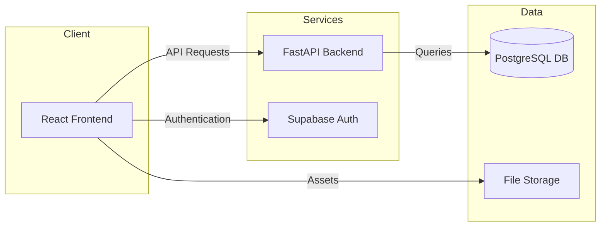
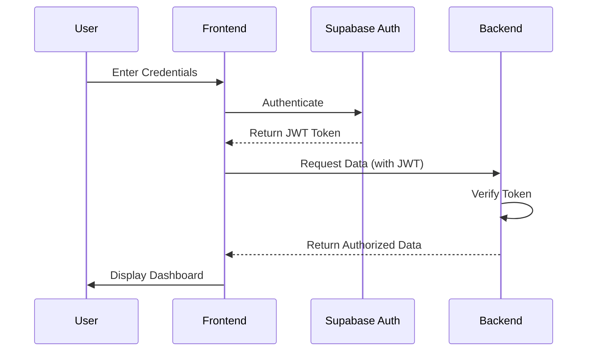
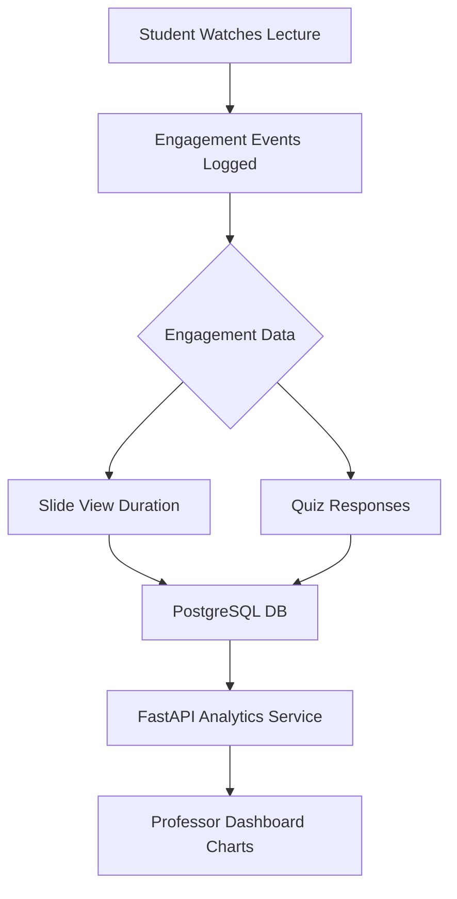
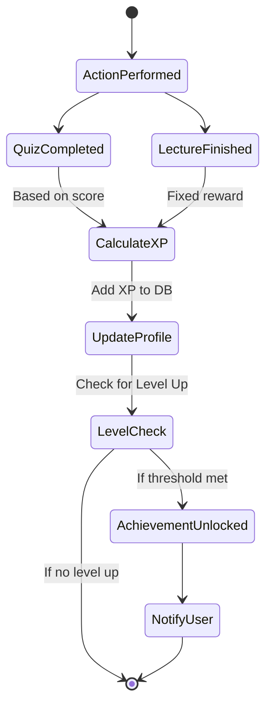

# Project Diagrams

This document contains Mermaid diagrams visualizing the architecture and workflows of Ascend Academy. These can be rendered in many Markdown editors or online at [Mermaid Live Editor](https://mermaid.live/).

## 1. High-Level System Architecture
Visualizes how the different parts of the system interact.

## 2. User Authentication Flow
The process of a user logging in and accessing protected data.

## 3. Analytics Data Pipeline
How student interactions turn into professor insights.

## 4. Gamification XP Engine
How experience points are calculated and rewarded.

