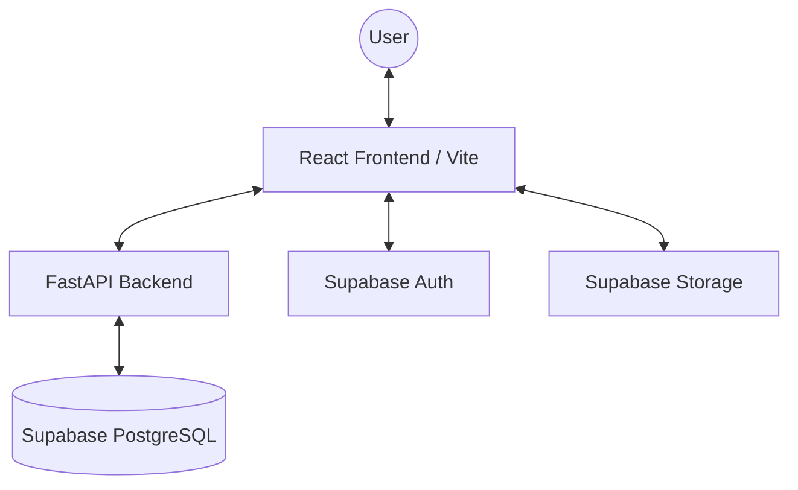

# Technical Report: System Architecture & Implementation

## 1. System Architecture
The Ascend Academy platform follows a modern, decoupled architecture consisting of a React-based frontend, a FastAPI backend, and Supabase for database and authentication services.

### Architecture Diagram

## 2. Technology Stack

### Frontend
- **Framework**: React 18 with TypeScript.
- **Build System**: Vite for rapid development and optimized builds.
- **Styling**: Tailwind CSS for responsive design and Shadcn/UI for accessible component architecture.
- **State Management**: 
  - **TanStack Query**: For efficient server-state synchronization and caching.
  - **React Context API**: For global UI and authentication state.

### Backend
- **Framework**: FastAPI (Python) for high-performance, asynchronous API endpoints.
- **Validation**: Pydantic models for strict data validation and serialization.
- **Asynchronous Processing**: Leveraging Python's `async/await` for scalable performance.

### Infrastructure (Backend-as-a-Service)
- **Database**: Supabase (PostgreSQL) for relational data storage.
- **Authentication**: Supabase Auth providing secure JWT-based identity management.
- **Storage**: Supabase Storage for managing lecture materials and user assets.

## 3. Database Schema Highlights
The system utilizes a relational schema optimized for analytics and gamification:
- **Profiles**: Extended user data including XP and level tracking.
- **Lectures**: Metadata for learning modules.
- **Slides**: Individual slide data linked to lectures.
- **Engagement Logs**: Granular tracking of time spent per slide and quiz interactions.
- **Achievements**: Definitions and user-earned badges.

## 4. Key Implementation Details

### Analytics Engine
The backend aggregates millions of engagement data points into actionable insights. It uses optimized PostgreSQL queries to calculate:
- Average time spent per slide.
- Quiz completion rates and difficulty indices.
- Cohort-level engagement trends.

### Gamification Logic
A custom XP system calculates rewards based on:
- Lecture completion.
- Quiz accuracy.
- Time consistency.

## 5. Security Measures
- **Role-Based Access Control (RBAC)**: Ensuring students and professors have access only to relevant features.
- **JWT Verification**: All backend requests are validated against Supabase-issued tokens.
- **Environment Isolation**: Sensitive credentials are managed through environment variables (`.env`).
