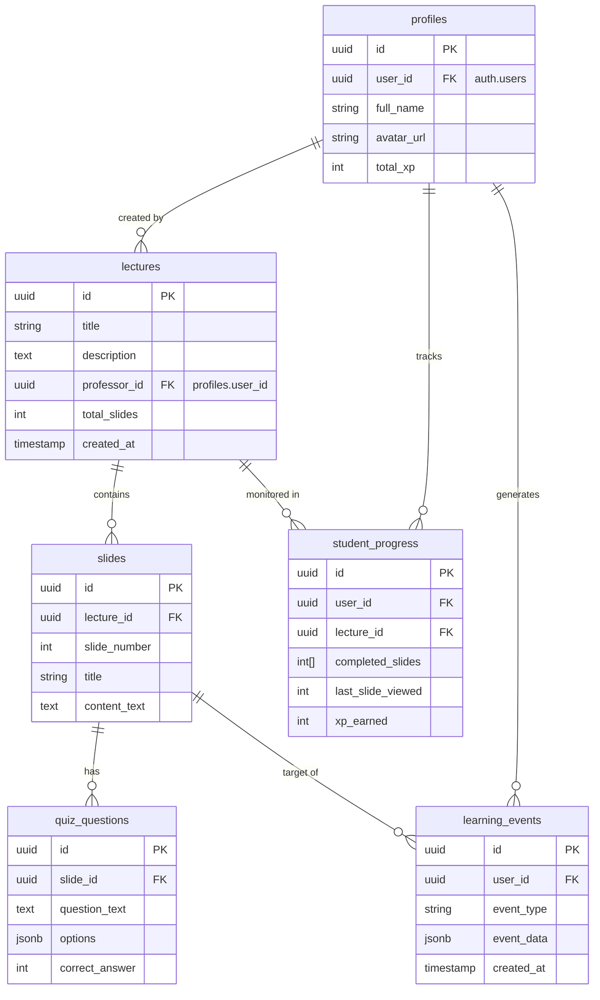

# Database Schema

## Overview
The Learnstation database is hosted on **Supabase** (PostgreSQL). It manages users, content (lectures, slides), and analytics data (events, progress).

## Entity Relationship Diagram (Mermaid)

## Table Dictionary

### 1. `profiles`
Stores public user information. Linked to Supabase Auth `auth.users`.
- **id**: Primary Key
- **user_id**: Foreign Key to `auth.users`
- **role**: 'student' or 'professor' (Managed via `user_roles` table in implementation)

### 2. `lectures`
Courses or lessons created by professors.
- **professor_id**: The user who uploaded the lecture.

### 3. `slides`
Individual pages within a lecture.
- **lecture_id**: Parent lecture.
- **content_text**: The markdown or text content of the slide.

### 4. `student_progress`
Tracks the aggregate state of a student in a lecture.
- **completed_slides**: Array of slide numbers finished.
- **xp_earned**: Gamification points.

### 5. `learning_events`
Immutable log of actions for analytics.
- **event_type**: `slide_viewed`, `quiz_completed`, etc.
- **event_data**: JSON blob containing details (e.g., duration, score).
