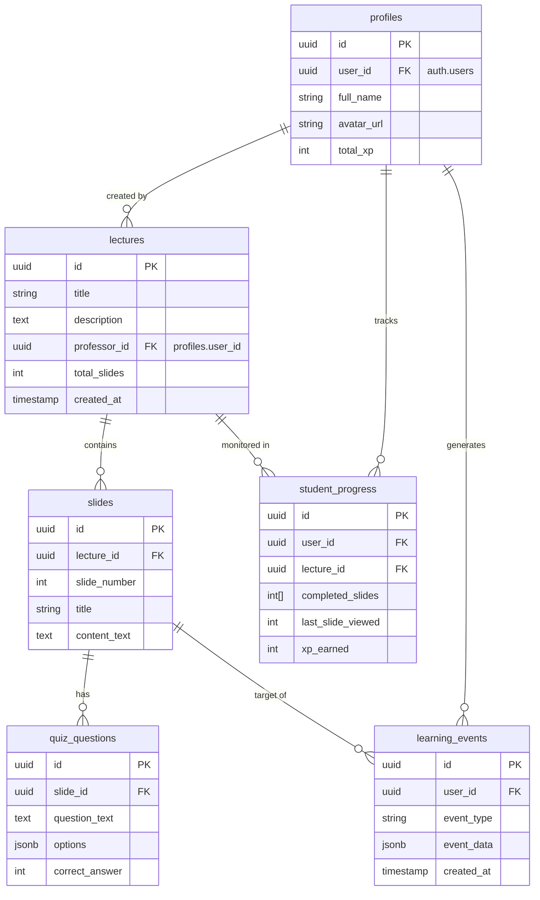

# Database Schema

## Overview
The Learnstation database is hosted on **Supabase** (PostgreSQL). It manages users, content (lectures, slides), and analytics data (events, progress).

## Entity Relationship Diagram (Mermaid)

## Table Dictionary

### 1. `profiles`
Stores public user information. Linked to Supabase Auth `auth.users`.
- **id**: Primary Key
- **user_id**: Foreign Key to `auth.users`
- **role**: 'student' or 'professor' (Managed via `user_roles` table in implementation)

### 2. `lectures`
Courses or lessons created by professors.
- **professor_id**: The user who uploaded the lecture.

### 3. `slides`
Individual pages within a lecture.
- **lecture_id**: Parent lecture.
- **content_text**: The markdown or text content of the slide.

### 4. `student_progress`
Tracks the aggregate state of a student in a lecture.
- **completed_slides**: Array of slide numbers finished.
- **xp_earned**: Gamification points.

### 5. `learning_events`
Immutable log of actions for analytics.
- **event_type**: `slide_viewed`, `quiz_completed`, etc.
- **event_data**: JSON blob containing details (e.g., duration, score).

### 6. `practice_sheets`
Practice sheets attached to a lecture.
- **kind**: `auto` (generated from quiz_questions) or `manual` (professor-authored).
- **status**: `draft` (only visible to professor) or `published` (visible to enrolled students).
- **created_by**: The professor who created the sheet.
- Unique constraint: at most one `auto` sheet per lecture.

### 7. `practice_sheet_questions`
Questions within a practice sheet.
- **type**: `multiple_choice`, `short_answer`, or `free_form`.
- **choices**: JSON array of option strings (multiple_choice only).
- **correct_answer**: The expected answer text; used for auto-grading MC and short_answer.
- **source_quiz_question_id**: FK to `quiz_questions` for auto-generated sheets (nullable).
- **order_index**: Display order within the sheet.

### 8. `practice_attempts`
Records a student's (or professor's preview) submission.
- **answers**: JSON map of `{question_id: answer_text}`.
- **score**: Float 0–100, auto-graded on submission (null if all questions are free-form).
- **is_preview**: `true` for professor preview attempts — excluded from student analytics.
